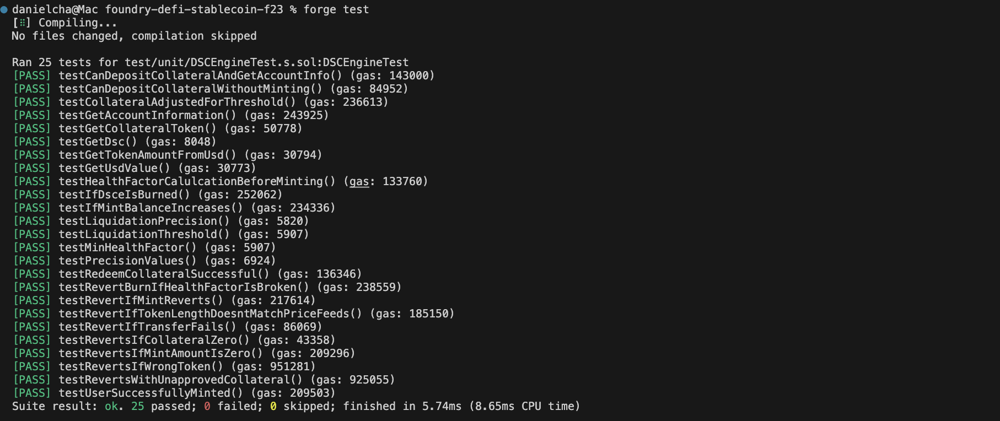

# 💵 Decentralized Stablecoin (DSC)

A fully algorithmic, exogenous-collateral stablecoin system pegged to USD — built with Solidity and Foundry. Modeled loosely after MakerDAO's DAI but with no governance, no fees, and collateral limited to WETH and WBTC.

> **Author:** Daniel Cha  
> **Stack:** Solidity · Foundry · Chainlink Price Feeds · OpenZeppelin  
> **Networks:** Ethereum Sepolia Testnet · Local Anvil

---

## What Is This?

DSC is a dollar-pegged stablecoin that maintains its peg through overcollateralization. Users deposit WETH or WBTC as collateral and mint DSC against it. The system enforces that the total collateral value always exceeds the total DSC supply — if a user's position becomes undercollateralized, external liquidators are incentivized to close it.

No admin controls the peg. No central party can mint DSC arbitrarily. The rules are enforced entirely on-chain.

---

## Architecture

```
src/
  DecentralizedStableCoin.sol   # ERC20 token, owned and controlled by DSCEngine
  DSCEngine.sol                 # Core logic: collateral, minting, liquidations, health factors
  libraries/
    OracleLib.sol               # Chainlink stale price check wrapper
script/
  DeployDSC.s.sol               # Deployment script
  HelperConfig.s.sol            # Network config (Sepolia + Anvil)
test/
  unit/
    DSCEngineTest.t.sol         # Unit tests
  fuzz/
    Handler.t.sol               # Fuzz handler — constrains valid actions
    Invariant.t.sol             # Invariant tests — system-level property checks
  mocks/
    MockV3Aggregator.sol        # Mock Chainlink price feed for local testing
```

### Two-Contract Design

**`DecentralizedStableCoin.sol`** is a minimal ERC20 with burn/mint restricted to its owner. At deploy time, ownership is immediately transferred to `DSCEngine` — meaning only the engine can ever mint or burn DSC. No human retains that power.

**`DSCEngine.sol`** is the core. It holds all collateral, tracks all positions, enforces health factors, and handles liquidations. It is the sole owner of the DSC token contract.

---

## Key Concepts

### Overcollateralization
The system requires 200% collateralization at all times. A user must deposit $200 of ETH to mint $100 of DSC. This is enforced via a liquidation threshold of 50%:

```
Health Factor = (Collateral Value × 0.5) / DSC Minted
```

If health factor drops below 1.0, the position is eligible for liquidation.

### Health Factor
Every state-changing operation checks the caller's health factor after execution and reverts if it's broken. This makes it impossible to leave the system in an undercollateralized state through normal interaction.

```solidity
function _revertIfHealthFactorIsBroken(address user) internal view {
    uint256 userHealthFactor = _healthFactor(user);
    if (userHealthFactor < MIN_HEALTH_FACTOR) {
        revert DSCEngine__BreaksHealthFactor(userHealthFactor);
    }
}
```

### Liquidations
If a user's health factor drops below 1 (e.g. ETH price crashes), anyone can liquidate them:
- Liquidator pays off the user's DSC debt
- Liquidator receives the equivalent collateral value **plus a 10% bonus**
- This incentivizes liquidators to act quickly, keeping the system solvent

```
Example:
  User has: $140 ETH collateral, $100 DSC minted
  ETH price drops → Health Factor < 1
  Liquidator covers $100 DSC debt
  Liquidator receives: $100 + $10 bonus = $110 of ETH
```

### Stale Price Protection (OracleLib)
All Chainlink price feed reads go through `OracleLib.staleCheckLatestRoundData()`, which reverts if the price hasn't been updated within the expected heartbeat window. This prevents the system from operating on stale prices during oracle outages.

---

## Invariant Testing

This project uses **fuzz-based invariant testing** — the same methodology used by professional smart contract auditors.

### The Core Invariant
```
Total collateral value (in USD) ≥ Total DSC supply
```
This must hold after every possible sequence of actions. If it ever breaks, the stablecoin is insolvent.

### Handler Pattern
Rather than letting the fuzzer call functions randomly (which would mostly hit reverts), a `Handler` contract constrains the fuzzer to only call functions in valid states:

- `depositCollateral` — mints and approves mock tokens before depositing
- `mintDsc` — only mints up to the safe limit for a real depositor
- `redeemCollateral` — only redeems up to what the user has deposited

```solidity
// The invariant the fuzzer must never break
function invariant_protocolMustHaveMoreValueThanTotalSupply() public view {
    uint256 totalSupply = dsc.totalSupply();
    uint256 wethValue = dsce.getUsdValue(weth, IERC20(weth).balanceOf(address(dsce)));
    uint256 wbtcValue = dsce.getUsdValue(wbtc, IERC20(wbtc).balanceOf(address(dsce)));
    assert(wethValue + wbtcValue >= totalSupply);
}
```

The commented-out `updateCollateralPrice` function in `Handler.sol` is intentional — enabling it causes the invariant to break, which correctly demonstrates the known limitation: if collateral crashes faster than liquidators can act, the system can become insolvent.


---

## Prerequisites

- [Foundry](https://book.getfoundry.sh/getting-started/installation)
- [Git](https://git-scm.com/)

```bash
curl -L https://foundry.paradigm.xyz | bash
foundryup
```

---

## Quickstart

```bash
git clone https://github.com/DanCsoftware/<repo-name>
cd <repo-name>
forge install
forge build
```

---

## Running Tests

```bash
# All tests (unit + invariant)
forge test

# Verbose output
forge test -vvv

# Invariant tests only
forge test --match-path test/fuzz/*

# With gas report
forge test --gas-report
```

---

## Local Deployment (Anvil)

```bash
# Terminal 1
anvil

# Terminal 2
forge script script/DeployDSC.s.sol --rpc-url http://localhost:8545 --broadcast
```

`HelperConfig` auto-detects Anvil (chainId `31337`) and deploys mock price feeds and ERC20 tokens for WETH and WBTC. No real tokens or external oracles needed locally.

---

## Sepolia Testnet Deployment

### 1. Environment Setup

```bash
# .env (never commit this file)
PRIVATE_KEY=your_wallet_private_key
SEPOLIA_RPC_URL=https://eth-sepolia.g.alchemy.com/v2/your_key
ETHERSCAN_API_KEY=your_etherscan_key
```

```bash
source .env
```

### 2. Get Testnet Assets

- Sepolia ETH: [sepoliafaucet.com](https://sepoliafaucet.com)
- Sepolia WETH: [app.uniswap.org](https://app.uniswap.org) (wrap ETH on Sepolia)

### 3. Deploy

```bash
forge script script/DeployDSC.s.sol \
  --rpc-url $SEPOLIA_RPC_URL \
  --broadcast \
  --verify \
  -vvvv
```

---

## Contract Interface

```solidity
// Core user actions
function depositCollateralAndMintDsc(address token, uint256 collateralAmt, uint256 dscAmt) external;
function redeemCollateralForDsc(address token, uint256 collateralAmt, uint256 dscAmt) external;
function depositCollateral(address token, uint256 amount) public;
function redeemCollateral(address token, uint256 amount) public;
function mintDsc(uint256 amount) public;
function burnDsc(uint256 amount) public;
function liquidate(address collateral, address user, uint256 debtToCover) external;

// View functions
function getAccountInformation(address user) external view returns (uint256 dscMinted, uint256 collateralValue);
function getAccountCollateralValue(address user) public view returns (uint256);
function getUsdValue(address token, uint256 amount) public view returns (uint256);
function getTokenAmountFromUsd(address token, uint256 usdAmount) public view returns (uint256);
function getHealthFactor(address user) external view returns (uint256);
```

---

## Security Notes

- DSC mint/burn is exclusively controlled by `DSCEngine` via OpenZeppelin `Ownable`
- All state changes enforce health factor post-execution — impossible to leave system undercollateralized through normal interaction
- Chainlink price feeds protected against stale data via `OracleLib`
- `nonReentrant` modifier on all collateral and mint/burn operations
- CEI (Checks-Effects-Interactions) pattern followed throughout

---

## Known Limitations

- If collateral prices crash faster than liquidators can respond, the system can become undercollateralized — this is the fundamental risk of all overcollateralized stablecoin designs
- Only WETH and WBTC are supported as collateral
- No governance mechanism for updating parameters

---

## Acknowledgments

Built following the [Cyfrin Updraft](https://updraft.cyfrin.io/) Foundry course by Patrick Collins. Extended with handler-based invariant testing, stale oracle protection via OracleLib, and a full liquidation incentive system.